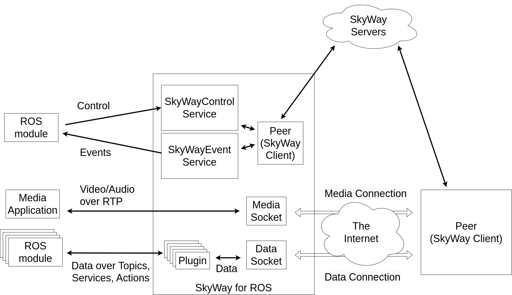

# SkyWay for ROS

ROSからSkyWayを利用するためのパッケージです。

端末間でP2P接続を行うための規格としてWebRTCが標準化されています。
SkyWayはWebRTCプラットフォームであり、SkyWayを利用することで、ブラウザ・iOS・Androidなどの環境で相互にWebRTC接続を簡単に行うことができます。
WebRTCは映像と音声を双方向通信するためのMediaStreamと、データを転送するためのDataChannelが定義されています。
Skyway for ROSを利用することで、MediaStreamとDataChannelをROSパッケージから利用することができます。

全体的なモジュール構成は下図の通りです。

SkyWay for ROSでは2つのサービスが提供されており、これらを利用し操作を行うことで、外部プログラム(Peer)に対してMediaStreamとDataConnection(over DataChannel)の確立を行います。
 
- [SkyWayControl](./srv/SkyWayControl.srv)
- [SkyWayEvents](./srv/SkyWayEvents.srv)

SkyWay for ROS内のMediaSocketに対してRTP/RTCPを送信することで、確立されたMedia Connectionを経由して、Peerに対して映像と音声を送ることができます。
また、データ転送用のROS Pluginをユーザ側で定義することができ、そのPluginに対してROS Topic, Service, Actionなどを用いてデータを送受信することで、
Peerとデータのやりとりを行うことができます。

## 操作方法とAPI仕様

まずSkyWay for ROS内に、SkyWayサーバとやり取りするために　Peer Objectを生成します。以下のドキュメントを参照してください。

- [PeerObjectの生成](./doc/peer_create.md)
- [PeerObjectの状態確認](./doc/peer_create.md)

Peer Objectが生成できたら、MediaConnection, DataConnectionの接続処理及び待ち受けが行えるようになります。以下のページを参照してください。

- [MediaConnectionの確立](./doc/media_call.md)
- [MediaConnectionの待ち受け](./doc/media_answer.md)
- [DataConnectionの確立](./doc/data_connect.md)
- [DataConnectionの待ち受け](./doc/data_connect.md)
- [イベントの監視](./doc/event_request.md)

DataConnectionが確立できたら、Pluginを介して外部ROS Moduleとデータのやり取りを行えます。
Pluginの仕様については[こちらのドキュメント](./doc/plugin.md)を参照してください。

[tips](./doc/tips.md)も参照して下さい。

## サンプル・実行方法
[examples](./examples)ディレクトリ及び[skyway_for_ros_examples](https://github.com/ntt-t3/skyway_for_ros_examples)リポジトリを参照して下さい。
