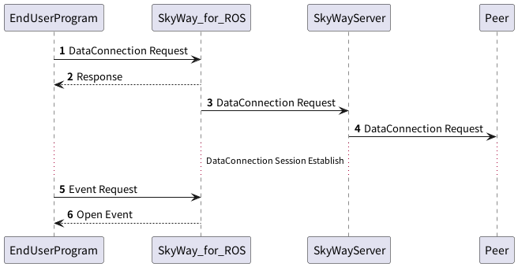
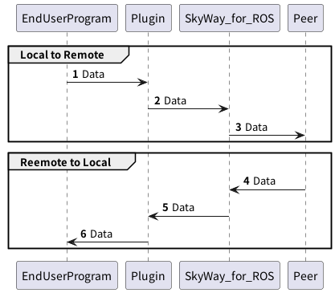

## DataChannelの確立要求

端末間でP2Pセッションを確立させるため、端末間で接続情報を交換する必要があります。
この情報交換にはSkyWayサーバを利用するため、まずはSkyWayサーバに接続を行います。



### 1. DataConnection Requestの送信

SkyWay for ROSに対して、`skyway_control`サービスを介してDataConnectionの生成リクエストを送ります。
メッセージの内容は以下の通りです。

**DataConnection Request**

| Field        | Type                       | Description    |
|--------------|----------------------------|----------------|
| request_type | String                     | `DATA`で固定です    |
| command      | String                     | `CONNECT`で固定です |
| params       | DataConnectionRequestPrams | 下表参照           


**DataConnection Request Params**

| Field           | Type                         | Description                                                                                                       |
|-----------------|------------------------------|-------------------------------------------------------------------------------------------------------------------|
| peer_id         | String                       | PeerObjectとして登録されたPeerIdです                                                                                        |
| token           | String                       | PeerObjectを利用するための識別キーとして利用するためのTokenです                                                                           |
| target_id       | String                       | 接続相手のPeerIdを指定します                                                                                                 |
| plugin_info     | Array of JsonObject          | Pluginのロード時に各Pluginに渡されるJSONオブジェクトを指定します。<br/>JSONオブジェクトの中にはロードするROS Pluginを指定するための`plugin_name`フィールドを含める必要があります。 |

**RTCDataChannelInit**

| Field         | Type     | Description                                 |
|---------------|----------|---------------------------------------------|
| serialization | String   | `NONE`固定です                                  |
| dcInit        | DcInit   | 確立するDataChannelの設定を指定します                    |
| metadata      | String   | DataChannel確立時に、相手側にmetadataを指定することができます    |


**DclInit**

| Field             | Type            | Description                                                                                                     |
|-------------------|-----------------|-----------------------------------------------------------------------------------------------------------------|
| ordered           | Boolean(option) | 通信経路上でジッタの影響を受けた場合、パケットの到着順が変わる可能性があります。パケットの到着順を保証させたい場合は `true`、しない場合は`false`を指定します                           |
| maxPacketLifeTime | Integer(option) | 確立するDataChannelの設定を指定します                                                                                        |
| maxRetransmits    | Integer(option) | DataChannel確立時に、相手側にmetadataを指定することができます                                                                        |
| protocol          | String(option)  | DataChannelのサブプロトコルを指定できます                                                                                      |
| negotiated        | Boolean(option) | DataChannel確立アルゴリズム中でnegotiationを行うかどうかを指定します。詳細は[W3Cのサイトを参照](https://w3c.github.io/webrtc-pc/#rtcdatachannel)  |
| id                | Integer(option) | negotiatedを指定した場合、channel IDを指定できます                                                                             |
| priority          | Integer(option) | candidateのpriorityを指定できます                                                                                       |


詳細は[W3Cのサイト](https://w3c.github.io/webrtc-pc/#dom-rtcdatachannelinit)をご確認ください。
不正な値を指定すると通信確立に失敗するため、特別な要望のない場合はDcInitフィールドは指定しないでください。

```json
{
  "request_type": "DATA",
  "command": "CONNECT",
  "params": {
    "peer_id": "data_caller",
    "token": "pt-96023714-d17f-4198-81a1-b64ec0d3a602",
    "target_id": "target_id", 
    "plugin_info": {
      "type": "string",
      "plugins": [
        {"plugin_name": "string_send_recv::StringSendRecv"}
      ]
    },
    "options": {
      "serialization": "NONE",
      "dcInit": {
        "ordered": false,
        "maxRetransmits": 0
      }, 
      "metadata": "{\"foo\": \"bar\"}"
    }
  }
}
```

### 2. DataConnection Responseの受信

WebRTC DataChannelは確立に時間がかかるため、非同期的に確立を行います。
DataConnection Responseは、　DataConnection Requestが正しいフォーマットで送信され、
DataChannelの接続を開始できたかどうかを返します。


**DataConnectionResponse**


| Field      | Type                         | Description    |
|------------|------------------------------|----------------|
| is_success | Boolean                      | 確立を開始したかを示します  |
| result       | DataConnectionResponseResult | 下表参照           |

**DataConnectionResponseResult**

| Field              | Type   | Description                                      |
|--------------------|--------|--------------------------------------------------|
| request_type       | String | `DATA`で固定です                                      |
| command            | String | `CONNECT`で固定です                                   |
| data_connection_id | String | DataConnectionを識別するためのIDです。ステータスの確認や切断などの際に利用します |

例) 成功の場合
```json
{
  "is_success":true,
  "result":{
    "request_type":"DATA",
    "command":"CONNECT",
    "data_connection_id":"dc-cdf0eb1c-a057-4a28-8c19-d25a6926e521"
  }
}
```

例) 存在しないPluginを指定して失敗した場合。
```json
{
  "is_success":false,
  "result":{
    "request_type":"DATA",
    "command":"CONNECT",
    "error":"LocalError(\"Failed to load string_send_recv::StringSendRecvAccording to the loaded plugin descriptions the class string_send_recv::StringSendRecv with base class type skyway_plugin::SkyWayStringPlugin does not exist. Declared types are  string_loopback::StringLoopback string_pub_sub::StringPubSub\")"}
}
```

### 3, 4 SkyWayサーバ、相手側Peerへの接続要求

これはSkyWay for ROSが内部的に実施するため、エンドユーザが意識する必要はありません。

### 5. Event Request

`skyway_events`サービスをコールし、イベント発火を待ちます。

### 6. Event Response

`skyway_events`サービスからの戻り値を取得することで、DataConnectionに関するイベントを監視できます。
詳細は[DataConnection Eventのページ](./data_event.md)を参照ください。

## DataConnectionを介してのデータ転送

DataConnectionが確立されると、指定したPluginが起動します。
各Plugin内で起動しているService, Topic, Action等を介してデータを送受信してください。

`OPEN`イベント発火直後からデータの送受信が可能です。

`CLOSE`イベント発火直後にPluginが開放され、データの送受信ができなくなります。


