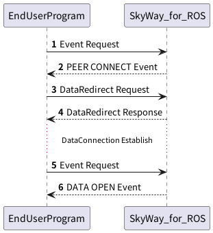

## DataRedirect



### 1. EventRequestの送信

`skyway_events`サービスにイベントの要求を送ります。
詳細は[EventRequestのページを参照](./event_request.md)

### 2. EventResponseの受信

`CONNECT` Eventを受信する。詳細は[PeerEventのページを参照](./peer_event.md)

### 3. DataRedirect Requestの送信

`skyway_control`サービスに以下のメッセージを送信することで、DataConnectionでデータを送受信するための設定を行います。

**DataRedirect Request**

| Field        | Type              | Description     |
|--------------|-------------------|-----------------|
| request_type | String            | `DATA`で固定です     |
| command      | String            | `REDIRECT`で固定です |
| params       | DataRedirectPrams | 下表参照            |

**DataRedirectParams**

| Field              | Type    | Description                                                                                             |
|--------------------|---------|---------------------------------------------------------------------------------------------------------|
| data_connection_id | String  | どのDataConnectionについてRedirectの設定を行うのか指定するためのID                                                           |
| plugin_info        | String  | DataConnection確立時に、エンドユーザプログラムとの間でデータのやり取りをするためのPluginをロードするための設定。<br/>このJSON Objectはロード時にPluginに渡されます。JSONオブジェクトの中にはロードするROS Pluginを指定するための`plugin_name`フィールドを含める必要があります。 |

例)
```json
{
  "request_type":"DATA",
  "command":"REDIRECT",
  "params":{
    "data_connection_id":"dc-477bd8ae-51fc-416e-ac2d-ccd209c0c674",
    "plugin_info":{
      "type": "string",
      "plugins": [{"plugin_name": "string_loopback::StringLoopback"}]
    }
  }
}
```

### 4. DataRedirect Responseの受信

DataRedirect Requestを受信後、SkyWay for ROSはDataConnectionのRedirect設定を非同期で実施します。
この時点では、正しいJSONメッセージを`skyway_control`サービスに対して与え、処理を開始できたかどうかのみを返します。

**DataConnectionResponse**

| Field      | Type                                 | Description    |
|------------|--------------------------------------|----------------|
| is_success | Boolean                              | 確立を開始したかを示します  |
| result       | DataConnectionRedirectResponseResult | 下表参照           |

**DataConnectionRedirectResponseResult**

| Field              | Type   | Description                                      |
|--------------------|--------|--------------------------------------------------|
| request_type       | String | `DATA`で固定です                                      |
| command            | String | `REDIRECT`で固定です                                  |
| data_connection_id | String | DataConnectionを識別するためのIDです。ステータスの確認や切断などの際に利用します |


例) 成功の場合
```json
{
  "is_success":true,
  "result":{
    "request_type":"DATA",
    "command":"REDIRECT",
    "data_connection_id":"dc-477bd8ae-51fc-416e-ac2d-ccd209c0c674"
  }
}
```

例) 存在しないPluginを指定して失敗した場合。
```json
{
  "is_success":false,
  "result":{
    "request_type":"DATA",
    "command":"REDIRECT",
    "error":"LocalError(\"Failed to load string_send_recv::StringSendRecvAccording to the loaded plugin descriptions the class string_send_recv::StringSendRecv with base class type skyway_plugin::SkyWayStringPlugin does not exist. Declared types are  string_loopback::StringLoopback string_pub_sub::StringPubSub\")"}
}
```

### 5. EventRequestの送信

`skyway_events`サービスにイベントの要求を送ります。
詳細は[EventRequestのページを参照](./event_request.md)

### 6. EventResponseの受信

`OPEN` Eventを受信する。詳細は[DataEventのページを参照](./data_event.md)

## DataConnectionを介してのデータ転送

DataConnectionが確立されると、指定したPluginが起動します。
各Plugin内で起動しているService, Topic, Action等を介してデータを送受信してください。

`OPEN`イベント発火直後からデータの送受信が可能です。

`CLOSE`イベント発火直後にPluginが開放され、データの送受信ができなくなります。


