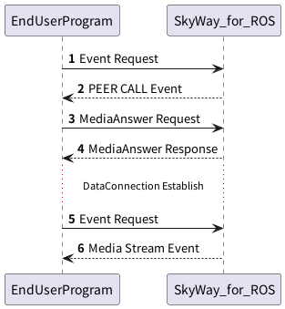
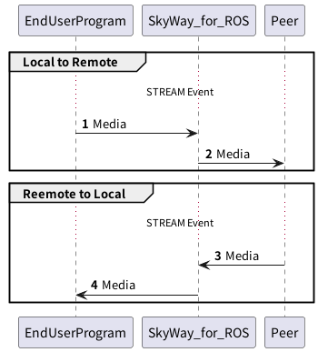

## MediaAnswer



### 1. EventRequestの送信

`skyway_events`サービスにイベントの要求を送ります。
詳細は[EventRequestのページを参照](./event_request.md)

### 2. EventResponseの受信

`CALL` Eventを受信する。詳細は[PeerEventのページを参照](./peer_event.md)

### 3. MediaAnswer Requestの送信

`skyway_control`サービスに以下のメッセージを送信することで、MediaConnectionでデータを送受信するための設定を行います。

**MediaAnswer Request**

| Field        | Type             | Description   |
|--------------|------------------|---------------|
| request_type | String           | `MEDIA`で固定です  |
| command      | String           | `ANSWER`で固定です |
| params       | MediaAnswerPrams | 下表参照          |

**MediaAnswerPrams**

| Field               | Type                       | Description                                  |
|---------------------|----------------------------|----------------------------------------------|
| media_connection_id | String                     | どのMediaConnectionについてAnswerの設定を行うのか指定するためのID |
| answer_query        | MediaAnswerQuery(optional) | MediaConnection確立時に、メディアの転送情報を指定できます         |

**MediaAnswerPrams**

| Field           | Type                          | Description                     |
|-----------------|-------------------------------|---------------------------------|
| constraints     | Constraints(optional)         | Mediaの性質に関する指定を行えます             |
| redirect_params | MediaRedirectParams(optional) | 相手Peerから受信したMediaの転送先を指定できます    |

**Constraints**

| Field        | Type                     | Description          |
|--------------|--------------------------|----------------------|
| video_params | MediaParameter(optional) | Videoの性質に関する指定を行えます  |
| audio_params | MediaParameter(optional) | Audioの性質に関する指定を行えます  |

**MediaParameter**

| Field         | Type    | Description                                   |
|---------------|---------|-----------------------------------------------|
| band_width    | Integer | Mediaのバンド幅を指定します                              |
| codec         | String  | Mediaのコーデックを指定します                             |
| payload_type  | Integer | RTP内のpayload typeフィールドで指定されているのと同じ番号を指定してください |
| sampling_rate | Integer | メディアのサンプリング周波数を指定します                          |

これらの情報は送信するRTPと合わせてください。不一致がある場合メディアは正常に転送されません。

**MediaRedirectParams**

| Field      | Type                          | Description             |
|------------|-------------------------------|-------------------------|
| video      | MediaRedirectParam(optional)  | Videoの転送先情報を指定できます      |
| video_rtcp | MediaRedirectParam(optional)  | Video RTCPの転送先情報を指定できます |
| audio      | MediaRedirectParam(optional)  | Audioの転送先情報を指定できます      |
| audio_rtcp | MediaRedirectParam(optional)  | Audio RTCPの転送先情報を指定できます |

**MediaRedirectParam**

| Field      | Type             | Description                                    |
|------------|------------------|------------------------------------------------|
| ip_v4      | String(optional) | 転送先アドレスをIPv4で指定できます。ip_v4, ip_v6のいずれかは指定してください |
| ip_v6      | String(optional) | 転送先アドレスをIPv6で指定できます                            |
| port       | Integer          | 転送先ポート番号です                                     |

例)
```json
{
  "request_type":"MEDIA",
  "command":"ANSWER",
  "params":{
    "media_connection_id":"mc-d9047c5c-7c19-424a-b0a5-9fd5f35d1664",
    "answer_query":{
      "constraints":{
        "video_params":{
          "band_width":1500,
          "codec":"H264",
          "payload_type":96,
          "sampling_rate":90000
        },
        "audio_params":{
          "band_width":1500,
          "codec":"OPUS",
          "payload_type":111,
          "sampling_rate":48000
        }
      },
      "redirect_params":{
        "video":{
          "ip_v4":"127.0.0.1",
          "port":47857
        },
        "video_rtcp":{
          "ip_v4":"127.0.0.1",
          "port":47475
        },
        "audio":{
          "ip_v4":"127.0.0.1",
          "port":60117
        },
        "audio_rtcp":{
          "ip_v4":"127.0.0.1",
          "port":46891
        }
      }
    }
  }
}
```

### 4. MediaAnswer Responseの受信

DataRedirect Requestを受信後、SkyWay for ROSはDataConnectionのRedirect設定を非同期で実施します。
この時点では、正しいJSONメッセージを`skyway_control`サービスに対して与え、処理を開始できたかどうかのみを返します。

**MediaAnswerResponse**

| Field      | Type                              | Description    |
|------------|-----------------------------------|----------------|
| is_success | Boolean                           | 確立を開始したかを示します  |
| result     | MediaAnswerRedirectResponseResult | 下表参照           |

**MediaAnswerRedirectResponseResult**

| Field               | Type            | Description                                                   |
|---------------------|-----------------|---------------------------------------------------------------|
| request_type        | String          | `MEDIA`で固定です                                                  |
| command             | String          | `ANSWER`で固定です                                                 |
| media_connection_id | String          | MediaConnectionを識別するためのIDです。ステータスの確認や切断などの際に利用します             |
| send_sockets        | MediaSocketInfo | 相手Peerへ送信するMediaに利用されているMedia ObjectのIDが格納されます。ユーザは直接的に利用しません |
| recv_sockets        | MediaRedirectParams | 相手Peerから受信したMediaの送信先としてユーザが指定した値が格納されます。ユーザは直接的に利用しません    |

例) 成功の場合
```json
{
  "is_success":true,
  "result":{
    "request_type":"MEDIA",
    "command":"ANSWER",
    "media_connection_id":"mc-d9047c5c-7c19-424a-b0a5-9fd5f35d1664",
    "send_sockets":{
      "video_id":"vi-1350a4aa-1ca2-4d0c-a410-7d29e891a33c",
      "audio_id":"au-bae5a5ee-0310-418c-bc4e-11417e3359fa"
    },
    "recv_sockets":{
      "video":{
        "ip_v4":"127.0.0.1",
        "port":47857
      },
      "video_rtcp":{
        "ip_v4":"127.0.0.1",
        "port":47475
      },
      "audio":{
        "ip_v4":"127.0.0.1",
        "port":60117
      },
      "audio_rtcp":{
        "ip_v4":"127.0.0.1",
        "port":46891
      }
    }
  }
}
```

### 5. EventRequestの送信

`skyway_events`サービスにイベントの要求を送ります。
詳細は[EventRequestのページを参照](./event_request.md)

### 6. EventResponseの受信

`STREAM` Eventを受信する。詳細は[DataEventのページを参照](./media_event.md)

## MediaConnectionを介してのデータ転送

MediaConnectionが確立され、Mediaの転送が可能な状態になると、STREAMイベントが発火します。
STREAMイベント内でデータの送受信に利用するポートの情報が格納されているので、その情報を利用してRTP/RTCPの送受信を行ってください。

`STREAM`イベント発火直後からデータの送受信が可能です。

`CLOSE`MediaConnectionが利用できなくなったタイミングで発火します。


