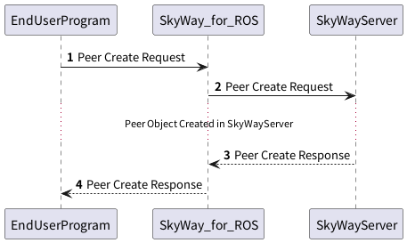

## SkyWayサーバへの接続

端末間でP2Pセッションを確立させるため、端末間で接続情報を交換する必要があります。
この情報交換にはSkyWayサーバを利用するため、まずはSkyWayサーバに接続を行います。



### 1. Peer Create Requestの送信

SkyWay for ROSに対して、`skyway_control`サービスを介してPeer Objectの生成リクエストを送ります。
メッセージの内容は以下の通りです。

**Peer Request**

| Field        | Type            | Description  |
|--------------|-----------------|--------------|
| request_type | String          | `PEER`で固定です   |
| command      | String          | `CREATE`で固定です |
| params       | PeerCreatePrams | 下表参照         |

**Peer Request Params**

| Field   | Type    | Description                                    |
|---------|---------|------------------------------------------------|
| key     | String  | SkyWayサーバで発行されたAPI Keyを入れてください(*1)  |
| domain  | String  | SkyWayサーバに登録したドメインを入れてください(*2)    |
| peer_id | String  | 相手側から接続する際に利用されるIDです(*3)           |
| turn    | Boolean | Turnサーバを利用するかどうかのフラグです(*4)         |

(*1, 2) SkyWayを利用するためには事前に[SkyWayサーバへ登録](https://webrtc.ecl.ntt.com/)が必要です。
SkyWayサーバへユーザ登録を行うと、API_KEYの生成が行なえます。API_KEYはdomainと紐づけての登録になります。
ブラウザプログラムとの接続を行う場合はWebサーバのドメインを登録してください。
Webサーバを建てない場合は、"localhost"でも登録を行えます

(*3) サーバへの事前登録は不要ですが、SkyWayサーバ上でのPeer Object生成の際に識別IDとして利用されるため、
API_KEYごとにユニークである必要があります。

(*4) P2P接続の確立に失敗した場合、SkyWayが提供している中継サーバを利用するようにフォールバックの設定を行うことができます。
利用する場合は`true`、利用しない場合は`false`に設定します

**例**
```json
{  
  "request_type":"PEER",  
  "command":"CREATE",  
  "params":{
    "key":"YOUR_API_KEY",
    "domain":"localhost",
    "peer_id":"foo",
    "turn":false
  }
}
```

### 2. SkyWayサーバに対するPeer Create Request

これはSkyWay for ROSが内部的に実施するため、エンドユーザが意識する必要はありません。

### 3. SkyWayサーバからのPeer Create Response

これはSkyWay for ROSが内部的に実施するため、エンドユーザが意識する必要はありません。

### 4. Peer Create Responseの取得

PeerCreateRequestに対する応答は、`skyway_control`サービスの戻り値として取得できます。

**Create Peer Response**

| Field      | Type            | Description                 |
|------------|-----------------|-----------------------------|
| is_success | Boolean         | PeerObjectの生成が成功したかどうかを示します |
| result     | object          | PeerObjectの生成の結果を示します       |

**Peer Request Result(成功時)**

| Field        | Type   | Description                             |
|--------------|--------|-----------------------------------------|
| request_type | String | `PEER`で固定です                             |
| command      | String | `CREATE`で固定です                           | 
| peer_id      | String | PeerObjectとして登録されたPeerIdです              |
| token        | String | PeerObjectを利用するための識別キーとして利用するためのTokenです |

**Peer Request Result(失敗時)**

resultフィールドに、エラー内容がJSONで格納されています。

例) PeerCreate成功時

```json
{
  "is_success":true,
  "result":{
    "request_type":"PEER",
    "command":"CREATE",
    "peer_id":"foo",
    "token":"pt-e8a07d68-7adb-4c8f-8cae-648cfa37d435"
  }
}
```

例) PeerCreate失敗時

```json
{
  "is_success": false,
  "result": "{\"reason\":\"InternalError\",\"message\":\"recv Forbidden\"}"
}
```

例えばPeer IDが重複していたり、API_KEYが間違っている場合はForbiddenが返されます。
またエンドユーザプログラムが異常終了した場合などは、WebRTC GatewayにPeer Objectの情報が残っているため、再起動が必要な場合があります。