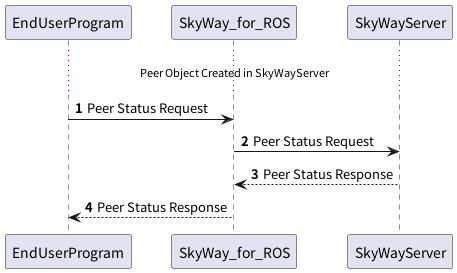

## Peerの状態の確認

Peer Objectの生成後に、Peer Objectの状態を確認することができます。



### 1. Peer Status Requestの送信
SkyWay for ROSに対して、`skyway_control`サービスを介してPeer Statusの確認リクエストを送ります。
メッセージの内容は以下の通りです。

**Peer Status Request**

| Field        | Type            | Description   |
|--------------|-----------------|---------------|
| request_type | String          | `PEER`で固定です   |
| command      | String          | `STATUS`で固定です |
| params       | PeerStatusPrams | 下表参照          |

**Peer Status Params**

| Field   | Type    | Description                                    |
|---------|---------|------------------------------------------------|
| peer_id      | String | PeerObjectとして登録されたPeerIdです              |
| token        | String | PeerObjectを利用するための識別キーとして利用するためのTokenです |

例)
```json
{
  "request_type": "PEER",
  "command": "STATUS",
  "params": {
    "peer_id": "foo",
    "token": "pt-e8a07d68-7adb-4c8f-8cae-648cfa37d435"
  }
}
```

### 2. Peer Status RequestのSkyWayサーバへの転送
これはSkyWay for ROSが内部的に実施するため、エンドユーザが意識する必要はありません。

### 3. Peer Status ResponseのSkyWayサーバからの受信
これはSkyWay for ROSが内部的に実施するため、エンドユーザが意識する必要はありません。

### 4. Peer Status Responseの受信
**Peer Status Result(成功時)**

| Field      | Type            | Description                 |
|------------|-----------------|-----------------------------|
| is_success | Boolean         | PeerObjectの生成が成功したかどうかを示します |
| result     | object          | PeerObjectの生成の結果を示します       |

**Peer Request Result(成功時)**

| Field        | Type    | Description                                    |
|--------------|---------|------------------------------------------------|
| request_type | String  | `PEER`で固定です                                    |
| command      | String  | `STATUS`で固定です                                  | 
| peer_id      | String  | PeerObjectとして登録されたPeerIdです                     |
| disconnected | Boolean | SkyWayサーバに接続されているかどうかを示します。接続できている場合は`false`です |

**Peer Status Result(失敗時)**

resultフィールドに、エラー内容がJSONで格納されています。

例)
```json
{
  "is_success": true,
  "result": {
    "request_type": "PEER",
    "command": "STATUS",
    "peer_id": "foo",
    "disconnected": false
  }
}
```

